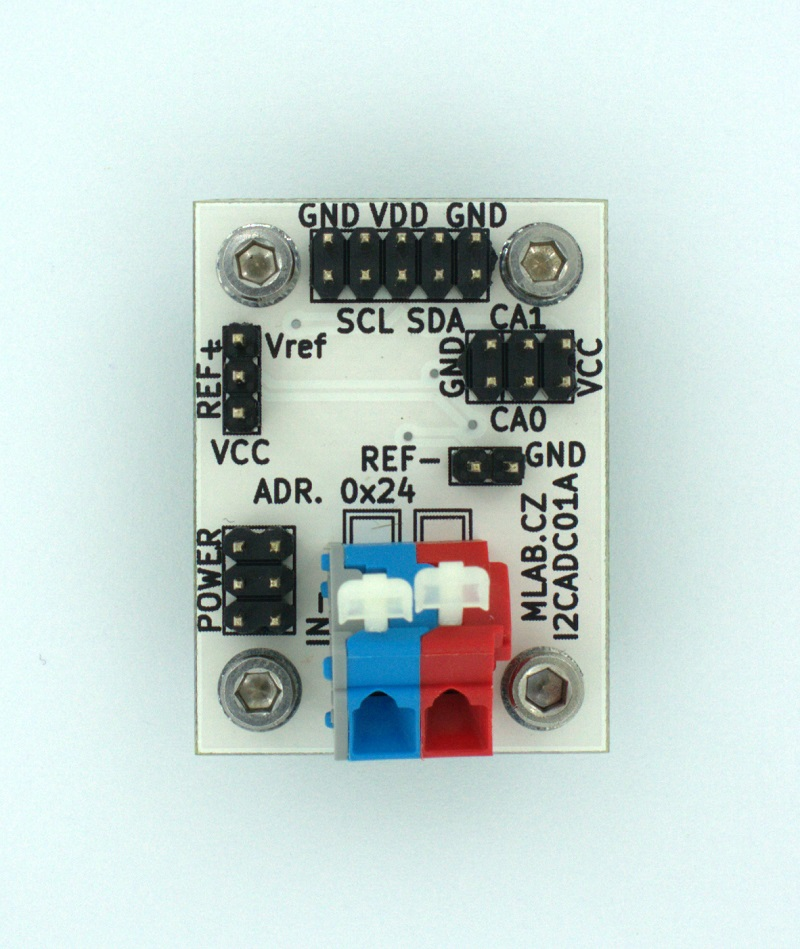

# I2CADC01A  - 24-bit ADC converter with I2C interface

The ADC includes a temperature sensor that can be used to compensate cold-junction temperature. Therefore, this module is suitable for use of temperature measurement by thermocouples.

